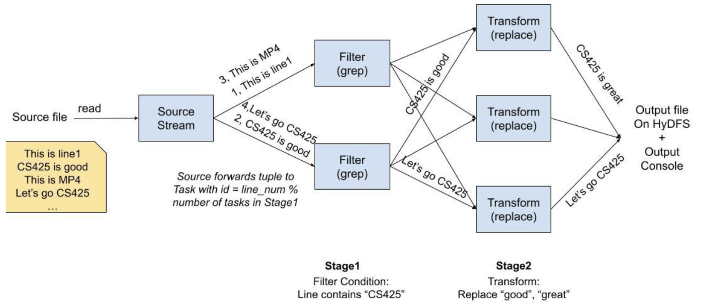

# RainStorm

A distributed stream processing system built from scratch in Go, combining a custom failure-detection layer, a distributed file system (HyDFS), and a stream processing engine with exactly-once semantics. Originally developed and benchmarked on a 10-node university VM cluster for CS425 Distributed Systems at UIUC — since the VMs are no longer accessible, the full multi-node environment is reproduced locally using Docker.

---

## Table of Contents

- [Overview](#overview)
- [System Architecture](#system-architecture)
- [Component 1 — Distributed Grep](#component-1--distributed-grep)
- [Component 2 — Membership & Failure Detection](#component-2--membership--failure-detection)
- [Component 3 — HyDFS Distributed File System](#component-3--hydfs-distributed-file-system)
- [Component 4 — RainStorm Stream Processing Engine](#component-4--rainstorm-stream-processing-engine)
- [Performance: RainStorm vs Apache Spark Streaming](#performance-rainstorm-vs-apache-spark-streaming)
- [Running Locally with Docker](#running-locally-with-docker)
- [Command Reference](#command-reference)

---

## Overview

RainStorm is a horizontally scalable stream processing system inspired by Apache Storm, built entirely from first principles. It processes continuous data streams through multi-stage pipelines of pluggable operators (grep, transform, aggregateByKey) with full fault tolerance and exactly-once processing guarantees — meaning every input record is processed exactly once even in the presence of node crashes and network failures.

The system was built in four phases, each layer depending on the one below it:

| Layer | Subsystem | Role |
|---|---|---|
| 1 | Distributed Grep | Distributed log search across nodes |
| 2 | Membership & Failure Detection | Gossip/PingAck protocols, crash detection in ~2s |
| 3 | HyDFS | Distributed file system with consistent-hash ring, RF=3 replication |
| 4 | RainStorm | Stream processing engine, leader-worker orchestration, exactly-once |

All subsystems run as a single unified daemon (`rainstormd`) on each node. The introducer node (node01) also acts as the RainStorm leader.

---

## System Architecture



The diagram above illustrates a two-stage RainStorm pipeline. The **Source Stream** reads a file from HyDFS and fans out tuples to Stage 1 tasks using round-robin partitioning (`tuple_id % n_tasks`). Each stage runs parallel task instances across different nodes:

- **Stage 1 — Filter (grep):** Each task receives a partition of the input stream and filters lines matching a condition (e.g., line contains "CS425"). Matching tuples are forwarded downstream.
- **Stage 2 — Transform (replace):** Each task receives filtered tuples and applies a text transformation (e.g., replace "good" / "great" with "CS425's great"). Final output is written to HyDFS and the output console.

Routing between stages uses hash partitioning on the tuple key, while tuple identity uses a globally unique `TupleID = {Stage, TaskIndex, Seq}` to enable exactly-once deduplication across the entire pipeline.

---

## Component 1 — Distributed Grep

The first layer implements distributed grep — a MapReduce-style search across a set of files spread over multiple machines. A coordinator dispatches grep tasks to worker nodes, each of which searches its local files for lines matching a regex pattern. Results are streamed back to the coordinator and merged into a single output, giving grep-at-scale across the entire cluster with no single machine needing to hold all the data.

This layer established the core patterns used throughout the rest of the project: fan-out task dispatch, parallel execution on worker nodes, and result aggregation — the same model that HyDFS and RainStorm build on.

---

## Component 2 — Membership & Failure Detection

The membership layer provides every node with a consistent, eventually-convergent view of which nodes are alive. It supports two protocols, switchable at runtime:

**Gossip protocol** — each node periodically selects random peers and exchanges its full membership table. State merges via max-incarnation rules, so the latest information always wins.

**PingAck protocol** — each node sends direct UDP pings to peers and expects acknowledgments within a timeout window. An inflight tracker detects missed ACKs and marks nodes as suspected, then failed.

Both protocols piggyback cluster configuration updates onto their normal messages, keeping all nodes in sync with zero extra traffic.

**Failure detection timeline:**
- `t_suspect = 1s` — node is marked suspected after 1s without response
- `t_fail = 2s` — node is declared failed after 2s
- `t_cleanup = 3s` — entry is garbage collected after 3s

New nodes join by contacting the introducer over TCP (port 6000). The introducer sends back the current membership list and the node begins gossiping immediately.

**Membership HTTP Admin API** (port 8080):

| Endpoint | Description |
|---|---|
| `GET /list_mem` | Full membership list with states |
| `GET /list_self` | This node's identity |
| `GET /display_protocol` | Active protocol (gossip / pingack) |
| `GET /display_suspects` | Currently suspected nodes |
| `POST /switch` | Switch protocol or toggle suspicion |
| `GET /leave` | Graceful leave |

---

## Component 3 — HyDFS Distributed File System

HyDFS (Hybrid Distributed File System) is a distributed object store designed for append-heavy workloads. It stores logical files as ordered sequences of chunks with a manifest per file that records all append operations with client IDs, sequence numbers, and timestamps.

**Consistent-hash ring:** Each node is assigned a token on a 64-bit ring. A file's replicas are placed on the 3 nodes whose tokens immediately follow the file's hash token (replication factor RF=3). When nodes join or leave, the `ReplicaManager` computes a local push/GC plan and re-replicates affected ranges via HTTP.

**Chunked storage + manifests:** Every file is represented by a manifest (an ordered log of append operations) and a set of raw chunk blobs. The manifest enables deterministic merging of concurrent appends across replicas — the `merge` operation reconciles all replicas to the same consistent state.

**Write model:**
- `create` — uploads a new file to RF replicas (requires min_replies=2 by default)
- `append` — adds a chunk to an existing file; manifests record the op idempotently so duplicate appends are safe
- `merge` — reconciles all replicas to a single consistent view

**Read model:**
- `get` — reads the latest version from any replica (quorum-read)
- `getfromreplica` — reads directly from a specific node, bypassing the ring

**Key design properties:**
- Re-replication is triggered automatically when the membership ring changes
- Garbage collection removes stale chunks from nodes that are no longer in a file's replica set
- `multiappend` enables concurrent appends from multiple nodes to the same file in a single operation

---

## Component 4 — RainStorm Stream Processing Engine

RainStorm processes data as a directed acyclic pipeline of stages. Each stage contains N parallel tasks distributed across worker nodes. The introducer VM runs the leader; all other nodes run workers.

### Leader

The leader handles all control-plane operations:
- **Job initialization** — allocates tasks across available workers, distributes routing metadata
- **Task scheduling** — assigns `(Stage, TaskIndex)` pairs to workers via HTTP
- **Failure recovery** — when a worker crashes (detected via MP1), the leader restarts all its tasks on surviving nodes, preserving the same `(Stage, TaskIndex)` identity so the task reuses its HyDFS log
- **Autoscaling** — a Resource Manager collects per-task input rates every second and scales stages up (when average rate > high watermark) or down (when average rate < low watermark)

### Workers

Each worker runs a supervisor agent that manages task processes. Workers:
- Spawn operator binaries as child processes (`grep-wrapper`, `aggregate-wrapper`, `transform-wrapper`, `echo-wrapper`)
- Route output tuples to downstream tasks using hash partitioning on the tuple key
- Report task metrics (input rate) to the leader every second
- Notify the leader immediately if a task process dies unexpectedly

### Exactly-Once Semantics

Exactly-once is guaranteed through a per-task append-only log stored on HyDFS:

**Tuple identity:** Every emitted tuple has a globally unique `TupleID = {Stage, TaskIndex, Seq}` where `Seq` is a per-task monotonically increasing counter reconstructed after restarts.

**HyDFS logging:** Each task maintains an in-memory buffer of log records (`META`, `IN`, `OUT`, `ACK`, `DEFERRED_ACK`, `EOS`). The buffer is flushed to HyDFS every 1 second to balance durability with write overhead — eager per-event writes caused ~4x slowdown in testing.

**Crash recovery:** When a task restarts, it:
1. Reads its existing HyDFS log and locates the segment for the current job (identified by the most recent `META` header)
2. Reconstructs `LastSeqNoProduced`, the `Seen` set (fully processed tuples), and the `Pending` set (emitted but unacknowledged tuples)
3. Resumes exactly where it left off — no tuple is processed twice, no output is dropped, no ACK is lost

**Consumer-side deduplication:** Every task maintains a `Seen` set. If an incoming tuple's ID is already in `Seen`, the task drops it but still enqueues a `DEFERRED_ACK` so the upstream producer stops resending. The ACK is only delivered after the next HyDFS flush, guaranteeing durable causal ordering.

### Stream Operators

Operators are standalone statically-linked Linux binaries invoked by workers via stdin/stdout:

| Binary | Function | Example args |
|---|---|---|
| `grep-wrapper` | Filter rows containing a pattern in a specific column | `grep-wrapper Parking 4` |
| `grep-wrapper2` | Variant grep with multi-column projection | `grep-wrapper2 Switzerland 0 1 2` |
| `transform-wrapper` | Replace text patterns in matched rows | `transform-wrapper good CS425` |
| `aggregate-wrapper` | Count occurrences by key (aggregateByKey) | `aggregate-wrapper` |
| `echo-wrapper` | Pass-through with optional transforms | `echo-wrapper 100 200` |

---

## Performance: RainStorm vs Apache Spark Streaming

Benchmarks ran on a **10-node cluster** (1 leader + 9 workers), with autoscaling disabled and input rate fixed at **250 tuples/sec** across 5 trials.

Two applications were tested on two datasets:

**Dataset 1 — Hotels (25,000 rows):** Hotel details including city, country, rating, and booking URL.
**Dataset 2 — Transactions (50,000 rows):** Synthetic financial transaction records for fraud/AML detection.

**Application 1:** Filter by keyword → aggregate count by a category column
- Dataset 1: grep for `booking.com` in the URL column → count hotels per country
- Dataset 2: grep for `Yen` transfers → count by receiver bank location

**Application 2:** Filter by keyword → project specific columns
- Dataset 1: grep for hotels in Switzerland → collect hotel IDs and names (columns 1–3)
- Dataset 2: grep for Euro transactions → collect time, date, sender (columns 1–3)

**Results:** RainStorm achieved consistently higher and more stable throughput than Spark Streaming across all four application/dataset combinations at the 250 tps input rate. Spark Streaming's lower throughput in equal-rate comparisons is partly structural — because Spark cannot natively stream from a static CSV, the benchmark throttles input via a rate source, forcing processing in fixed-size micro-batches. Under these conditions, RainStorm incurs less per-record overhead for filter-aggregate and filter-project pipelines.

As dataset size increases (25k → 50k rows), the performance gap narrows — Spark's execution engine becomes more efficient on larger datasets.

---

## Running Locally with Docker

The system was originally deployed on university VMs which are no longer accessible. Docker replicates the multi-node distributed environment faithfully: each container gets its own hostname, network namespace, and IP address, and Docker's internal DNS handles inter-node name resolution — exactly like the VM setup.

### Prerequisites

- Docker Desktop (or Docker Engine + Docker Compose)
- ~1 GB disk space for the image

### Start the cluster

```bash
git clone https://github.com/hershdoshi55/rainstorm.git
cd RainStorm/RainStorm

docker compose up --build -d
```

This builds the image and starts 6 containers:
- `rainstorm-node01` — introducer + RainStorm leader (ports 8080, 10010, 15000 exposed to host)
- `rainstorm-node02` through `rainstorm-node05` — workers
- `rainstorm-ctl` — interactive control client

Wait about 15 seconds for all nodes to join the membership ring, then verify:

```bash
curl -s http://localhost:8080/list_mem
# Should show "count":5
```

### Open the control client

```bash
docker exec -it rainstorm-ctl /app/rainstormctl -is-ctl-client -hydfs-http=node01:10010 -rainstorm-http=node01:15000
```

This drops you into the `RainStorm>` REPL. Type `help` for a command list or `exit` to quit.

> Files you place in `./ctl_data/` on your host are accessible inside the ctl container as local files. The `create` and `append` commands read from this directory.

### Tear down

```bash
docker compose down
```

---

## Command Reference

### HyDFS File Operations

All commands are run inside the `RainStorm>` REPL.

**Upload a local file to HyDFS:**
```
create <localfile> <hydfs-name>
```
`<localfile>` is relative to `./ctl_data/` (e.g., put `dataset1.csv` in `ctl_data/` first).

```
create dataset1.csv dataset1.csv
```

**Download a file from HyDFS:**
```
get <hydfs-name> <localfile>
```
```
get dataset1.csv local-copy.csv
```
The downloaded file appears in `./ctl_data/` on your host.

**Append a local file to an existing HyDFS file:**
```
append <localfile> <hydfs-name>
```
```
append dataset2.csv dataset1.csv
```

**Merge all replicas to a consistent state:**
```
merge <hydfs-name>
```
```
merge dataset1.csv
```

**List replicas and ring token for a file:**
```
ls <hydfs-name>
```
```
ls dataset1.csv
```

**List all files stored on the connected node:**
```
liststore
```

**List all ring nodes with their tokens:**
```
list_mem_ids
```

**Download directly from a specific replica node:**
```
getfromreplica <node-alias> <hydfs-name> <localfile>
```
Use a 2-digit alias (`01`–`05`). The node must actually hold a replica of the file (check `ls` first).
```
getfromreplica 03 dataset1.csv from-node03.csv
```

**Concurrent append from multiple nodes:**
```
multiappend <hydfs-name> <node1> <node2> ... <localfile1> <localfile2> ...
```
The target HyDFS file must already exist. The local files must exist on each respective node.
```
# First plant files on the nodes:
docker exec rainstorm-node02 sh -c 'echo "data" > /home/mp4/local_file_store/f.txt'
docker exec rainstorm-node03 sh -c 'echo "data" > /home/mp4/local_file_store/f.txt'

# Then in the ctl REPL:
multiappend target.txt 02 03 f.txt f.txt
```

**Create N copies of a local file in HyDFS:**
```
multicreate <n> <localfile>
```
```
multicreate 5 dataset1.csv
```

---

### RainStorm Stream Processing

**Submit a job:**
```
rainstorm <n_stages> <n_tasks_per_stage> -stage-config-map "<map>" <src_file> <dest_file> <exactly_once> <autoscale> <input_rate> <low_watermark> <high_watermark>
```

| Parameter | Description |
|---|---|
| `n_stages` | Number of processing stages |
| `n_tasks_per_stage` | Parallel tasks per stage |
| `-stage-config-map` | Maps each stage to an operator and its args |
| `src_file` | Input file name (must be present in each node's source dir — CSVs from `rainstorm_dataset/` are copied automatically at startup) |
| `dest_file` | Output HyDFS file name |
| `exactly_once` | `true` / `false` |
| `autoscale` | `true` / `false` (disabled when exactly-once is on) |
| `input_rate` | Tuples per second fed from the source |
| `low_watermark` | Scale-down threshold (%) for autoscaling |
| `high_watermark` | Scale-up threshold (%) for autoscaling |

**Stage config map format:** `stage<N> <operator> [args...] stage<M> <operator> [args...]`

**Example — filter hotels in Switzerland, aggregate by country:**
```
rainstorm 2 3 -stage-config-map "stage0 grep-wrapper Switzerland 2 stage1 aggregate-wrapper" hotels.csv out.txt true false 100 20 80
```

**Example — filter Yen transactions, aggregate by receiver bank:**
```
rainstorm 2 3 -stage-config-map "stage0 grep-wrapper Yen 5 stage1 aggregate-wrapper" transactions.csv out.txt true false 100 20 80
```

**List running tasks:**
```
list_tasks
```
Output shows each task's node, PID, operator, and log file. Use this to get the node alias and PID for `kill_task`.

**Kill a specific task (demonstrates fault tolerance):**
```
kill_task <node-alias> <pid>
```
The leader immediately reschedules the killed task on a different node. Run `list_tasks` again to see the new assignment.
```
kill_task 04 31
list_tasks
```

**Read the job output:**
```
get out.txt result.txt
```

---

### Membership API (from host terminal)

These `curl` commands hit node01's admin API directly (port 8080 is exposed to the host).

**Full membership list:**
```bash
curl -s http://localhost:8080/list_mem
```

**This node's identity:**
```bash
curl -s http://localhost:8080/list_self
```

**Active protocol:**
```bash
curl -s http://localhost:8080/display_protocol
```

**Switch protocol (toggles between gossip and pingack):**
```bash
curl -s http://localhost:8080/switch
```

**Switch to pingack with suspicion enabled (1s suspect timer):**
```bash
curl -s -X POST http://localhost:8080/switch \
  -d '{"protocol":"pingack","suspicion":"enabled","suspicion_time":"1s"}' \
  -H 'content-type: application/json'
```

**Switch to gossip with suspicion disabled:**
```bash
curl -s -X POST http://localhost:8080/switch \
  -d '{"protocol":"gossip","suspicion":"disabled"}' \
  -H 'content-type: application/json'
```

**List suspected nodes:**
```bash
curl -s http://localhost:8080/display_suspects
```

---

### Fault Tolerance Demo

**Simulate a node crash:**
```bash
docker stop rainstorm-node05
sleep 4
curl -s http://localhost:8080/list_mem   # count drops to 4
docker logs --tail 20 rainstorm-node01  # shows failure detection and re-replication
```

**Bring the node back:**
```bash
docker start rainstorm-node05
sleep 8
curl -s http://localhost:8080/list_mem   # count returns to 5
```

If a RainStorm job is running during the failure, the leader detects the crash via the membership layer and reschedules the dead node's tasks on surviving workers within seconds.

---

### Port Reference

| Port | Protocol | Service |
|---|---|---|
| 5000 | UDP | Membership gossip / ping-ack |
| 6000 | TCP | Introducer join |
| 8080 | HTTP | Membership admin API |
| 10010 | HTTP | HyDFS daemon |
| 15000 | HTTP | RainStorm daemon |
